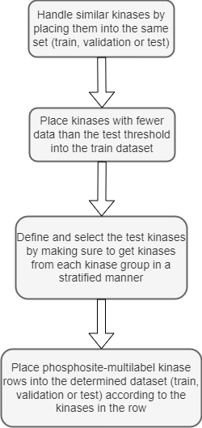

# DARKIN
Hello! This is the official repository for our paper "DARKIN: A zero-shot classification benchmark and an evaluation of protein language models". You can find our paper at [this link](https://openreview.net/pdf?id=a4x5tbYRYV) for more detail.

DARKIN is a dataset created for the Zero-Shot Learning setup and you could create different versions of DARKIN in a reproducible manner by playing around with the available parameters. This repo will go over these topics:
1. The DARKIN dataset:
2. How to Create Embeddings
3. How to Run Baseline K-NN Experiments
4. How to Run the Bi-Linear Zero Shot Model (BZSM) Experiments

## 1. The DARKIN Dataset
### 1.1. DARKIN and its Implementation Strategy

DARKIN is a dataset consisting of phosphorylation data, mainly it contains rows of phosphosites and the kinases which phosphorylate these specific phosphosites. So the phosphosites are the inputs, and the kinases are the labels. Also since a phosphosite could be phosphorylated by several kinases, it is not unusual to see multiple kinases associated with a single phosphosite in the dataset. DARKIN is created for the Zero-Sot learning setup, thus the kinases present in the train, validation and test sets are all disjoint. Here is a sample snapshot of a portion of the dataset:

| SUB_ACC_ID | SUB_MOD_RSD | SITE_+/-7_AA | KINASE_ACC_IDS |
|:---------|:---------|:---------|:---------|
|P68101|S52|MILLSELsRRRIRSI|Q9BQI3|
|P83268|S51|RILLsELsR______|Q9BQI3|
|P05198|S52|MILLsELsRRRIRsI|P28482,Q7KZI7,Q9BQI3,Q9NZJ5|
|P05198|S49|IEGMILLsELsRRRI|Q9BQI3,Q9NZJ5|

There are several strategies utilized when creating the dataset splits:

- **Number of phosphosites per kinase**: To ensure robust evaluation in the test and validation sets, we set a minimum threshold for the number of phosphosite-kinase pair associations a kinase should have in order to be defined as a test or validation kinase. This is to make sure that the scores obtained for a specific kinase class in test or validation do not rely on very few data, since results obtained on very few data points could be misleading. 
- **Stratification based on kinase groups**: Data points are stratified into train, validation and test sets based on kinase groups. This is to ensure that every kinase group is represented in each set whenever feasible.  
- **Sequence similarity of kinases**: To prevent optimistic performance estimates, kinases with sequence similarity above a parameterized threshold  are grouped and assigned to the same set (train, validation, or test).

Here is the high level illustration of the steps of our dataset splitting strategy implementation:

<p align="center">
  
</p>

### 1.2. How to generate a DARKIN split in your local environment

### 1.2.1. Installation & Setting up the Environment

As the first step you have to download this repository to your local environment. You can either download it az a zip file or just clone the repository like this:

```
git clone git@github.com:tastanlab/darkin.git
```

Now you have to create a conda environment to be able to run the code. Create the conda environment like this:

```
conda create --name darkin python=3.11.3
```

then activate this conda environment:

```
conda activate darkin
```

install pip if it is not installed:

```
conda install pip
```

now install the required packages. You could either use the requirements.txt file like this:

```
pip install -r requirements.txt
```

or you could directly install the required packges like this:

```
pip install pandas
pip install numpy
pip install matplotlib
```

now you should be all set to run the code!

### 1.2.2. Running the Code

Now you are ready to run the code and create the DARKIN dataset in your local environment. To run the code, you have to run the create_darkin_split.py file like this:

```
python create_darkin_split.py
```

There are several parameters which you could play around with, according to your specific interests (Please refer to section 1 is these parameters are confusing to you):

| Parameter | Description |
|:---------|:---------|
| <sub>RANDOM_SEED</sub> | <sub>The random seed which is set at the beggining of the script, to ensure the same split on different runs of the script. This variable could also be used to create different splits to see the performance on different splits of the data. In our paper we have used random seeds 0, 42, 87 and 12345. We have used random seed 12345 as our default split.</sub> |
| <sub>KINASE_SIMILARITY_PERCENT</sub> | <sub>The identity similarity score percentage of the kinase domains that will be taken into consideration when splitting the dataset. (Kinase domains which have similarity equal to or above this percentage will be placed inside the same set, so they will all be added to either the train, validation or test set)</sub> |
| <sub>KINASE_COUNT_TEST_THRESHOLD</sub> | <sub>This is the number of phosphosite-kinase association threshold for kinases to be able to enter the test dataset. Kinases which have fewer phosphosite-kinase associations than this threshold will not be considered to be placed into the test set.</sub> |
| <sub>STRATIFY_PERCENTAGE_FOR_UNSEEN_TEST_KINASE</sub>| <sub>The percentage of the dataset size that should be entered into the test set as unseen data.</sub> |
| <sub>TEST_GZSL_PERCENTAGE</sub> | <sub>The percentage of how much of a seen kinase’s data will be placed into the test dataset. After a kinase is decided to be a seen kinase, this much percentage of it’s data will be placed into test, and the rest will be inside train. (This is only valid for the General Zero-Shot Learning setup)</sub> |
| <sub>KINASE_COUNT_VALIDATION_THRESHOLD</sub> | <sub>This is the number of phosphosite-kinase association threshold for kinases to be able to enter the validation dataset. Kinases which have fewer phosphosite-kinase associations than this threshold will not be considered to be placed into the validation set.</sub> |
| <sub>STRATIFY_PERCENTAGE_FOR_UNSEEN_VALIDATION_KINASE</sub> | <sub>The percentage of the dataset size that should be entered into the validation set as unseen data.</sub> |
| <sub>VALIDATION_GZSL_PERCENTAGE</sub> | <sub>The percentage of how much of a seen kinase’s data will be placed into the validation dataset (here seen means in the context of train-validation split). After a kinase is decided to be a seen kinase, this much percentage of it’s data will be placed into validation, and the rest will be inside train.</sub> |
| <sub>INCLUDE_VALIDATION | <sub>Whether to perform the train-validation split. If selected True, then the script will first perform train-test split, and then will divide train into train-validation.</sub> |
| <sub>TAKE_SEQUENCE_SIMILARITY_INTO_CONSIDERATION</sub> | <sub>This parameter defines whether to take kinase domain sequence similarity into consideration when splitting the datasets. If selected True, kinases who have sequence similarity equal to or above the KINASE_SIMILARITY_RATE will be placed into the same dataset. </sub> |
| <sub>DIVIDE_WRT_GROUP</sub> | <sub>Defines whether to stratify the kinases with respect to the kinase groups. If set to False, the dataset will be split without taking the kinase group information into account, thus datasets might have imbalanced kinase groups.</sub> |

These parameters could be modified in the create_darkin_split.py file directly. Or else the parameters could be set when running create_darkin_split.py like this:

```
python create_darkin_split.py --RANDOM_SEED 12
```

### 1.3. Dataset Statistics

In order to provide better insight in the dataset split that has been generated, the file dataset_statistics.py is implemented. Several different dataset statistics could be found here. The plots that could be generated are listed as follows:

1. **Kinase Count**: This plot shows the number of kinases in each set (train, validation and test).
2. **Phosphosite Count**: This plot shows the number of phosphosites in each set (train, validation adn test). 
3. **Phosphosite-Kinase Count**: This plot shows the number of phosphosite-kinase association data points in each set (train, validation and test).
4. **Phosphosite-Kinase Count Histogram of Kinases**: This histogram shows how many phosphosite-kinase data is associated with how many kinases in the train, validation and test sets. 
5. **Multilabel Phosphosites vs Single Kiase Phosphosites**: A single phosphosite could be phosphorylated by several kinases. A phosphosite which is associated with several kinases is named as multilabel phosphosite/site, and a phosphosite which is phosphorylated by a single kinase is named as single kinase phosphosite. This plot illustrates the number of multilabel and single kinase phosphosites in the train, validation and test sets.
6. **Novel Site vs Common Site in Test**: A phosphosite could be phosphorylated by several kinases, thus a phosphosite could appear in different sets. We call sites which only appear in a single set such as train, validation or test set as novel sites. Likewise we call phosphosites which appear in several sets as common sites between those sets. In this plot we report the number of novel sites in the test set, and the number of common sites with the train and validation sets.
7. **Novel Site vs Common Site in Each Set**: In this plot we show the number of novel and common sites for each set (First row). Furthermore we also show the number of phosphosite-kinase data point association corresponding to these kinases (Second row).
8. **Phosphosite Kinase Association Histogram of Kinases**: In this plot, we show the number of phosphosites associated with the number of kinases specified in the x label. 
9. **Kinase Group Distribution**: This plot illustrates the number of kinases from each group for that specific set (First row). Furthermore it also illustrates the number of phosphosite-kinase association data points these kinases correspond to in that specific set (second row).
**Several more could be added...**:

#### 1.3.1. How to Generate these Dataset Statistics

After generating the DARKIN split, the dataset statistics could be generated by running the dataset_statistics.py file (The function call lines at the bottom of the script should be uncommented). Another option to generate the dataset statistics is by using the dataset_statistics.ipynb notebook file. Here are the steps to follow in order to run this notebook if you are running on a remote server:

First install jupyter notebook:

```
pip install jupyter
```

Run this line in your remote server to open jupyter notebook:

```
jupyter notebook --no-browser --port=8888
```

Then open an SSH tunnel from your local PC like this:
```
ssh -v -N -L 8888:localhost:8888 your_username@your_server_ip
```

Then you could access jupyter notebbok from http://localhost:8888/ on your browser. On your first login it might ask you for credentials, in this case follow the steps mentioned in the remote server side (a token id will be provided like this: http://localhost:8888/?token=token_id). Now you are ready to run the provided dataset_statistics.ipynb file. 

#### 1.3.2. Dataset Statistics of our Default DARKIN Split

<p align="left">
  
  
  
</p>

<p align="left">
  
</p>

<p align="left">
  
  
</p>

<p align="left">
  
  
  
</p>


## 2. How to Create Embeddings

The `create_embedding.py` script computes embeddings for protein sequences using Hugging Face models and saves them in a `.pt` file.

### 2.1 Usage

```bash
python create_embedding.py [--input-files file1.csv file2.csv | --sequence SEQUENCE] \
    --model-id MODEL_ID \
    [--column-name COLUMN_NAME] \
    [--embedding-type {cls,avg,all}] \
    [--batch-size BATCH_SIZE] \
    [--device {auto,cpu,cuda}] \
    [--max-length MAX_LENGTH] \
    [--output-file OUTPUT_FILE]
```

### 2.2 Options

- `--input-files`  
  One or more CSV files containing a column of sequences.

- `--sequence`  
  A single protein sequence string (mutually exclusive with `--input-files`).

- `--column-name`  
  Column name in CSV files (default: `sequence`).

- `--model-id`  
  Hugging Face model identifier (e.g., `Rostlab/prot_bert`).

- `--embedding-type`  
  Type of embedding:  
  - `cls`: embedding of the `[CLS]` token 
  - `avg`: average pooling of token embeddings  
  - `all`: full sequence embeddings for each token (default)

- `--batch-size`  
  Batch size for processing (default: `32`).

- `--device`  
  Device to run on (`auto`, `cpu`, or `cuda`; default: `auto`).

- `--max-length`  
  Optional maximum sequence length (longer sequences are truncated).

- `--output-file`  
  Name of the output `.pt` file (default: `embeddings.pt`).

### 2.3 Examples

#### Embed a Single Sequence

```bash
python create_embedding.py --sequence "MTEITAAMVKELRESTGAGM" \
    --model-id Rostlab/prot_bert --embedding-type avg
```

#### Embed Sequences from a CSV

```bash
python create_embedding.py --input-files proteins.csv \
    --model-id facebook/esm2_t33_650M_UR50S --column-name seq \
    --batch-size 16 --device cuda --output-file esm_embeddings.pt
```

#### Embed from Multiple CSV Files

```bash
python create_embedding.py --input-files batch1.csv batch2.csv batch3.csv \
    --model-id facebook/esm2_t33_650M_UR50S \
    --embedding-type cls --max-length 512
```

## 3. How to Run Baseline K-NN Experiments

There are three scripts to run baseline K-Nearest Neighbors method. The first is the `create_similarity_matrices.py`. This is for speeding up the find the most similar kinases. The second one is `baseline_knn.py` which is the main script to conduct K-NN experiments. The last step is running `aupr_zsl.py` script to calculate the AP scores which is the evaluation metric of this study.
In the baseline setup, outputs of each step is the input of the consecutive step. 

### 3.1 Usage  `create_similarity_matrices.py`

```
python create_similarity_matrices.py  --phosphosite_emb_file </path/to/file> \
--kinase_emb_file </path/to/file> \
--kinase_properties_file </path/to/file> \
--taken_token <True or False> \
--group <True or False> \
--family <True or False> \
--ec <True or False> \
--cls_or_avg <cls, avg, or None>
--savepath </path>
```

#### 3.1.1 Options

- `--phosphosite_emb_filee`  
  Embedding file name which is obtained by creating embeddings step.

- `--kinase_emb_file`  
  Embedding file name which is obtained by creating embeddings step.

- `--kinase_properties_file`  
  File name which contains human kinases properties that is obtained in creating DARKIN split step.

- `--taken_token`  
  True or false depending on the embeddings, if the embeddings provide cls token and avg token embedding it is True.
  
- `--group`  
  True or False if you want to add kinase group information as an additional feature it is True.
  
- `--family`  
  True or False if you want to add kinase family information as an additional feature it is True.
  
- `--ec`  
  True or False if you want to add kinase enzyme classification information as an additional feature it is True.
  
- `--cls_or_avg`  
  cls or avg or None depending on how you want to use embeddings. None is only for BLOSUM, NLF and One-hot representations
  
- `--savepath`  
  Saving path which the similarity matrices is saved in as .json format

  #### 3.1.2 Example

  ```
  python3 create_similarity_matrices.py --phosphosite_emb_file ESM1b_PhosphositeEmb.pt \
  --kinase_emb_file ESM1b_KinaseEmb.pt \
  --kinase_properties_file kinase_properties.csv \
  --taken_token true \
  --group true \
  --family true \
  --ec true \
  --cls_or_avg avg \
  --savepath /ESM1b_Similarity_Matrices
  ```

### 3.2 Usage  `baseline_knn.py`

```
python baseline_knn.py  --traindata </path/to/file> \
--testdata </path/to/file> \
--kinase_properties_file </path/to/file> \
--k <integer> \
--phosphosite_similarity_file </path/to/file> \
--kinase_similarity_file </path/to/file> \
--savepath </path>
```

#### 3.2.1 Options

- `traindata`
  Name of train data file that is obtained in creating DARKIN split step.

- `testdata`
  Name of train data file that is obtained in creating DARKIN split step.

- `kinase_properties_file`
  File name which contains human kinases properties that is obtained in creating DARKIN split step.
  
- `k`
  The number of nearest neighbors.
  
- `phosphosite_similarity_file`
  File name of phosphosite similarity matrix which is obtained in creating similarity matrices step.
  
- `kinase_similarity_file`
  File name of kinase similarity matrix which is obtained in creating similarity matrices step.
  
- `savepath`
  Save path which prediction scores of kinases are saved in as .json format

#### 3.2.2 Example

```
python baseline_knn.py --traindata train_data.csv \
--testdata test_data.csv \
--kinase_properties_file kinase_properties.csv \
--k 3 \
--phosphosite_similarity_file PhosphositeAvg.json \
--kinase_similarity_file KinaseAvg.json \
--savepath /Experiments/ESM1b
```

### 3.3 Usage  `aupr_zsl.py`

```
python3 aupr_zsl.py --testdata </path/to/file> \
--kinase_properties_file </path/to/file> \
--kinase_similarity </path/to/file> \
--prediction_scores </path/to/file> \
--k <integer> \
--outputpath </path/to/file>
```

#### 3.3.1 Options

- `testdata`
  Name of train data file that is obtained in creating DARKIN split step.

- `kinase_properties_file`
  File name which contains human kinases properties that is obtained in creating DARKIN split step.

- `kinase_similarity`
  File name of kinase similarity matrix which is obtained in creating similarity matrices step.

- `prediction_scores`
  File name which contains the ranking scores of kinases for each test phoshosites.

- `k`
  The number of nearest neighbors.
  
- `outputpath`
  File name which saves the final prediction scores in terms of Aveage Precision by post processing predictions.


#### 3.3.2 Example

```
python3 aupr_zsl.py --testdata test_data.csv \
--kinase_properties_file kinase_properties.csv \
--kinase_similarity KinaseAvg.json \
--prediction_scores 3.json \
--k 3 \
--outputpath /Experiments/ESM1b
```

## 4. How to Run the Bi-Linear Zero-Shot Model (BZSM) Experiments

### 4.1. Running the BZSM Model

To run the Bi-Linear Zero-Shot Model, execute the `main.py` file located in the `bilinear_zero_shot_model` directory. This file supports several parameters:

- `mode`: Set this to either `'train'` or `'test'`.
- `config_path`: Specify the configuration `.yml` file you want to run.
- `num_of_models`: The number of models you wish to train.

**Example command:**
```bash
python -u main.py --mode train \
--config_path configs/to_carry/NLF_all.yaml \
--num_of_models 3
```

### 4.2. Setting Up the YML Files

Example configuration files are located in the `bilinear_zero_shot_model/configs/` directory. While these files contain many parameters, you’ll typically only need to modify the following:

- `['phosphosite']['dataset']['train']`, `['validation']`, `['test']`:  
  Paths to your training, validation, and test datasets. These should point to the DARKIN dataset splits. You can use default paths like:  
  `../Darkin_Dataset/datasets/random_seed_12345/ZSL/train_data_random_seed_12345.csv`.

- `['phosphosite']['dataset']['processor']['processor_type']`:  
  Specifies the protein language model (pLM) or word embedding used to encode phosphosites. Examples are available in the provided config files.

- `['phosphosite']['dataset']['processor']['phosphosite_embedding_path']`:  
  Path to the generated phosphosite embeddings. Refer to **Section 2** for instructions on how to create these.

- `['kinase']['dataset']['processor']['processor_type']`:  
  Specifies the protein language model or embedding method used for kinases. Again, examples can be found in the config files.

- `['kinase']['dataset']['processor']['phosphosite_embedding_path']`:  
  Path to the generated kinase embeddings. See **Section 2** for embedding creation details.

- `['phosphosite']['model']['embedding_mode']` and `['kinase']['model']['embedding_mode']`:  
  Sets how the embeddings are used. Available options:
  - `cls`: Use the CLS token from the embedding.
  - `avg`: Average all token embeddings.
  - `sequence`: Use the full embedding sequence.
  - `concat`: Concatenate all token embeddings into one long vector.

- `['kinase']['dataset']['processor']`:  
  Contains optional toggles such as `use_family`, `use_group`, etc. Set these to `true` or `false` depending on your experimental preferences.

- `['hyper_parameters']`:  
  Contains model training hyperparameters (e.g., learning rate, batch size, etc.). Adjust these according to your experimental setup.
